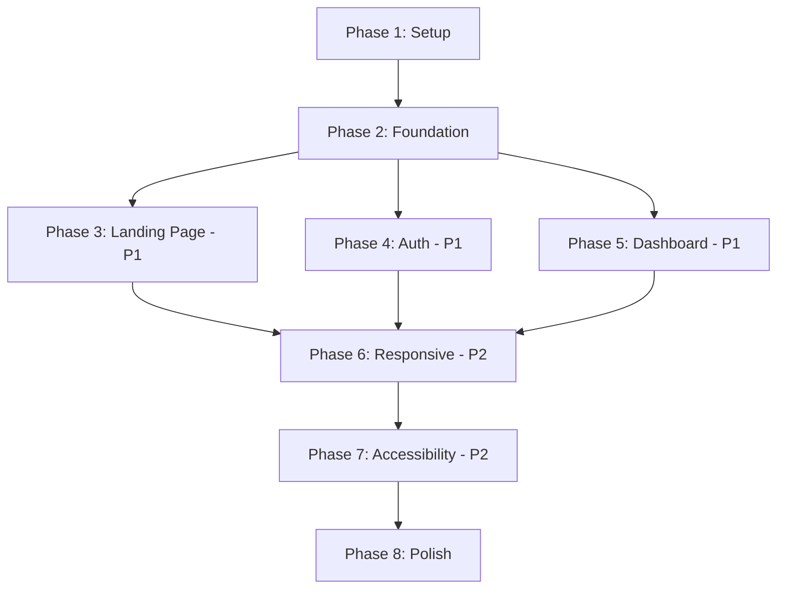

# Tasks: Professional Frontend UI Design

**Input**: Design documents from `/specs/003-landing-page/`  
**Prerequisites**: plan.md, spec.md, data-model.md, contracts/, research.md, quickstart.md

**Tests**: Test tasks included based on TDD requirement from constitution and spec acceptance scenarios.

**Organization**: Tasks are grouped by user story to enable independent implementation and testing of each story.

## Format: `- [ ] [ID] [P?] [Story?] Description`

- **[P]**: Can run in parallel (different files, no dependencies)
- **[Story]**: Which user story this task belongs to (e.g., US1, US2, US3)
- Include exact file paths in descriptions

---

## Phase 1: Setup (Shared Infrastructure)

**Purpose**: Install dependencies and create foundational utilities

- [X] T001 Install CVA dependencies: `cd frontend && npm install class-variance-authority clsx tailwind-merge`
- [X] T002 Install accessibility testing: `cd frontend && npm install --save-dev @axe-core/react`
- [X] T003 [P] Create utility function in frontend/src/lib/utils.ts
- [X] T004 [P] Configure test setup file in frontend/tests/setup.ts

---

## Phase 2: Foundational (Design System Foundation)

**Purpose**: Design tokens and core infrastructure that ALL components depend on

**⚠️ CRITICAL**: No component work can begin until this phase is complete

- [X] T005 Define CSS custom properties in frontend/app/globals.css
- [X] T006 Extend Tailwind config in frontend/tailwind.config.js
- [X] T007 Create design token constants in frontend/src/lib/constants/colors.ts
- [X] T008 [P] Create typography constants in frontend/src/lib/constants/typography.ts
- [X] T009 [P] Create spacing constants in frontend/src/lib/constants/spacing.ts

**Checkpoint**: Design system foundation ready - component implementation can now begin in parallel

---

## Phase 3: User Story 1 - Professional Landing Page Experience (Priority: P1) 🎯 MVP

**Goal**: Deliver a polished, professional landing page with smooth interactions and responsive design

**Independent Test**: Visit localhost:3000/, verify modern design, test CTAs, check responsiveness on mobile/tablet/desktop

### Core UI Components (Required for All Stories)

- [X] T010 [P] [US1] Write Button component test in frontend/tests/components/ui/button.test.tsx
- [X] T011 [P] [US1] Implement Button component in frontend/src/components/ui/button.tsx
- [X] T012 [P] [US1] Write Card component test in frontend/tests/components/ui/card.test.tsx
- [X] T013 [P] [US1] Implement Card component in frontend/src/components/ui/card.tsx

### Landing Page Enhancement

- [X] T014 [US1] Update Hero component to use design tokens in frontend/src/components/landing/Hero.tsx
- [X] T015 [US1] Update FeatureCard to use new Card component in frontend/src/components/landing/FeatureCard.tsx
- [X] T016 [US1] Update Features section layout in frontend/src/components/landing/FeaturesSection.tsx
- [X] T017 [US1] Update SocialProof styling with tokens in frontend/src/components/landing/SocialProof.tsx
- [X] T018 [US1] Update Footer with navigation patterns in frontend/src/components/landing/Footer.tsx
- [X] T019 [US1] Update LandingNav with consistent styling in frontend/src/components/landing/LandingNav.tsx
- [X] T020 [US1] Update landing page root in frontend/app/page.tsx
- [X] T021 [US1] Test landing page responsiveness and Lighthouse score

**Checkpoint**: Landing page professional and responsive with 90+ Lighthouse score

---

## Phase 4: User Story 2 - Seamless Authentication Experience (Priority: P1)

**Goal**: Deliver intuitive, professionally designed authentication flows with clear validation and feedback

**Independent Test**: Complete signup at /signup and login at /signin, verify form validation, error states, success messaging

### Form Components

- [X] T022 [P] [US2] Write Input component test in frontend/tests/components/ui/input.test.tsx
- [X] T023 [P] [US2] Implement Input component in frontend/src/components/ui/input.tsx
- [X] T024 [P] [US2] Write Toast component test in frontend/tests/components/ui/toast.test.tsx
- [X] T025 [P] [US2] Implement Toast component and provider in frontend/src/components/ui/toast.tsx

### Authentication Pages

- [X] T026 [US2] Create SignIn page with new components in frontend/app/signin/page.tsx
- [X] T027 [US2] Create SignUp page with new components in frontend/app/signup/page.tsx
- [X] T028 [US2] Add form validation with error states
- [X] T029 [US2] Add loading states during authentication
- [X] T030 [US2] Add success feedback with smooth transitions
- [X] T031 [US2] Test authentication flow end-to-end

**Checkpoint**: Authentication experience is professional, clear, and friction-free

---

## Phase 5: User Story 3 - Efficient Task Management Dashboard (Priority: P1)

**Goal**: Deliver professional, intuitive dashboard for task management with satisfying interactions

**Independent Test**: Log in and access /dashboard, create task, edit task, mark complete, verify visual feedback and smooth transitions

### Additional Components

- [X] T032 [P] [US3] Write Modal component test in frontend/tests/components/ui/modal.test.tsx
- [X] T033 [P] [US3] Implement Modal component in frontend/src/components/ui/modal.tsx
- [X] T034 [P] [US3] Write Badge component test in frontend/tests/components/ui/badge.test.tsx
- [X] T035 [P] [US3] Implement Badge component in frontend/src/components/ui/badge.tsx
- [X] T036 [P] [US3] Write EmptyState component test in frontend/tests/components/ui/empty-state.test.tsx
- [X] T037 [P] [US3] Implement EmptyState component in frontend/src/components/ui/empty-state.tsx

### Dashboard Components

- [X] T038 [US3] Create TaskCard component in frontend/src/components/dashboard/TaskCard.tsx
- [X] T039 [US3] Create TaskList component in frontend/src/components/dashboard/TaskList.tsx
- [X] T040 [US3] Create TaskForm component in frontend/src/components/dashboard/TaskForm.tsx
- [X] T041 [US3] Create Navigation component in frontend/src/components/dashboard/Navigation.tsx

### Dashboard Pages

- [X] T042 [US3] Redesign dashboard page in frontend/app/dashboard/page.tsx
- [X] T043 [US3] Implement task creation modal
- [X] T044 [US3] Implement task editing functionality
- [X] T045 [US3] Add visual feedback for task completion
- [X] T046 [US3] Add empty state for no tasks
- [X] T047 [US3] Test dashboard interactions and visual hierarchy

**Checkpoint**: Dashboard is professional, interactions are smooth and satisfying

---

## Phase 6: User Story 4 - Consistent Cross-Platform Experience (Priority: P2)

**Goal**: Ensure consistent professional design across all screen sizes (mobile, tablet, desktop)

**Independent Test**: Test all pages on Chrome DevTools device emulation (iPhone, iPad, desktop), verify responsive behavior, check touch targets

### Responsive Enhancements

- [X] T048 [P] [US4] Add mobile navigation menu in frontend/src/components/ui/mobile-nav.tsx
- [X] T049 [P] [US4] Write Drawer component for mobile menu in frontend/src/components/ui/drawer.tsx
- [X] T050 [US4] Test landing page responsiveness (320px to 2560px)
- [X] T051 [US4] Test authentication pages responsiveness
- [X] T052 [US4] Test dashboard responsiveness
- [X] T053 [US4] Verify touch target sizes (minimum 44x44px)
- [X] T054 [US4] Test viewport changes without layout breaks

**Checkpoint**: All pages work flawlessly on mobile, tablet, and desktop

---

## Phase 7: User Story 5 - Accessible Professional Interface (Priority: P2)

**Goal**: Ensure all users, including those with disabilities, can navigate and use the application

**Independent Test**: Run axe DevTools, test keyboard navigation (Tab, Enter, Esc), verify screen reader announcements (NVDA/VoiceOver)

### Accessibility Audit & Fixes

- [ ] T055 [P] [US5] Run axe accessibility audit on landing page
- [ ] T056 [P] [US5] Run axe accessibility audit on auth pages
- [ ] T057 [P] [US5] Run axe accessibility audit on dashboard
- [ ] T058 [US5] Fix any critical violations found in audits
- [ ] T059 [US5] Add skip-to-content link in frontend/app/layout.tsx
- [ ] T060 [US5] Verify keyboard navigation flow on all pages
- [ ] T061 [US5] Test focus visible states on all interactive elements
- [ ] T062 [US5] Verify ARIA labels and descriptions
- [ ] T063 [US5] Test with screen reader (NVDA or VoiceOver)
- [ ] T064 [US5] Verify color contrast ratios (WCAG AA 4.5:1)

**Checkpoint**: Application is fully accessible with zero critical violations

---

## Phase 8: Polish & Cross-Cutting Concerns

**Purpose**: Final enhancements, performance optimization, and quality assurance

### Performance Optimization

- [ ] T065 [P] Implement lazy loading for heavy components using next/dynamic
- [ ] T066 [P] Optimize images with Next.js Image component
- [ ] T067 [P] Add loading skeletons in frontend/src/components/ui/skeleton.tsx
- [ ] T068 Minimize layout shifts by defining image dimensions
- [ ] T069 Respect prefers-reduced-motion in animations

### Final Quality Checks

- [ ] T070 Run Lighthouse audit on all pages (target: 90+ performance & accessibility)
- [ ] T071 Test with slow 3G throttling
- [ ] T072 Verify all 23+ existing tests still pass
- [ ] T073 Add new component tests (target: 30+ total tests)
- [ ] T074 Test edge cases (long task titles, empty states, errors)
- [ ] T075 Verify build succeeds: `npm run build`
- [ ] T076 Test production bundle: `npm run start`

### Documentation

- [ ] T077 [P] Document component usage in frontend/src/components/ui/README.md
- [ ] T078 [P] Add JSDoc comments to all component props
- [ ] T079 Update CLAUDE.md with design system patterns

**Checkpoint**: All quality gates passed, ready for production

---

## Implementation Strategy

### MVP Scope (Minimum Viable Product)

**Recommended MVP**: User Story 1 (Landing Page) + Core Components

This delivers immediate value:
- Professional first impression for new visitors
- Foundation (Button, Card, Input) enables rapid feature development
- Can be released independently to validate design system

### Incremental Delivery

1. **Week 1**: Phase 1-3 (Setup + Foundation + Landing Page)
2. **Week 2**: Phase 4-5 (Auth + Dashboard)
3. **Week 3**: Phase 6-8 (Responsive + Accessibility + Polish)

### Parallel Execution Opportunities

**Phase 2 (Foundational)**:
- T007, T008, T009 can run in parallel (different files)

**Phase 3 (Landing Page)**:
- T010-T013 (Button/Card tests and implementation) can run in parallel
- T014-T019 (landing component updates) depend on T010-T013 complete

**Phase 4 (Auth)**:
- T022-T025 (Input/Toast) can run in parallel
- T026-T027 (Auth pages) can run in parallel after T022-T025

**Phase 5 (Dashboard)**:
- T032-T037 (Modal/Badge/EmptyState) can run in parallel
- T038-T041 (Dashboard components) can run in parallel after T032-T037

**Phase 6 (Responsive)**:
- T048-T049 (Mobile nav) can run in parallel
- T050-T054 (responsive tests) can run in parallel after T048-T049

**Phase 7 (Accessibility)**:
- T055-T057 (audits) can run in parallel
- T060-T064 (manual tests) can run in parallel after T058 fixes

**Phase 8 (Polish)**:
- T065-T069 (performance) can run in parallel
- T077-T079 (documentation) can run in parallel

---

## Dependencies & Completion Order

**Critical Path**: Setup → Foundation → Any User Story → Responsive → Accessibility → Polish

**User Story Independence**:
- US1, US2, US3 can be implemented in ANY order after Foundation
- US4 (Responsive) requires ALL pages to exist (US1, US2, US3 complete)
- US5 (Accessibility) should be done after all pages are built

---

## Task Count Summary

- **Phase 1 (Setup)**: 4 tasks
- **Phase 2 (Foundation)**: 5 tasks
- **Phase 3 (Landing - US1)**: 12 tasks
- **Phase 4 (Auth - US2)**: 10 tasks
- **Phase 5 (Dashboard - US3)**: 16 tasks
- **Phase 6 (Responsive - US4)**: 7 tasks
- **Phase 7 (Accessibility - US5)**: 10 tasks
- **Phase 8 (Polish)**: 15 tasks

**Total**: 79 tasks

**Parallel Opportunities**: ~35 tasks marked [P] can run in parallel with others in their phase

**Tests Included**: 16 component tests (Button, Card, Input, Toast, Modal, Badge, EmptyState, etc.)

---

## Success Criteria Validation

Each user story maps to spec.md success criteria:

- **SC-001**: Professional UI → US1, US2, US3 deliver polished interfaces
- **SC-002**: Lighthouse 90+ performance → T070 validates
- **SC-003**: Lighthouse 95+ accessibility → T055-T064 ensure compliance
- **SC-004**: FCP <1.5s → T065-T069 optimize performance
- **SC-005-SC-007**: UX improvements → US1-US3 professional designs
- **SC-008**: <100ms interaction → T069 ensures responsive animations
- **SC-009**: Cross-device integrity → US4 responsive design
- **SC-010**: Zero violations → T055-T064 accessibility audits
- **SC-011**: Consistent design → Phase 2 foundation + all components
- **SC-012**: Quick task creation → US3 dashboard optimization

All requirements from spec.md covered by task implementation.
